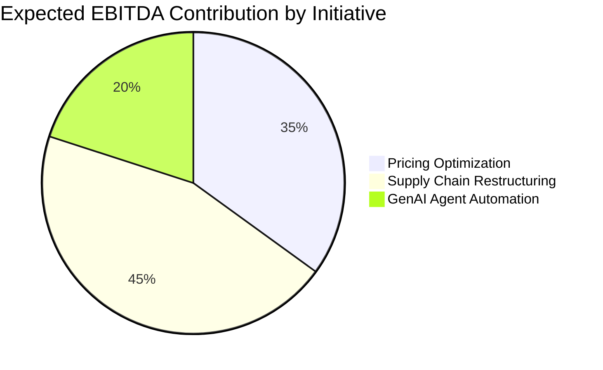
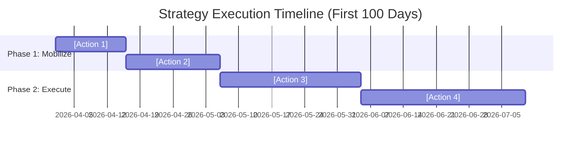

  
Strategic Analysis & Advisory

  <h1>[CLIENT/PROJECT NAME]</h1>
  
Strategic Roadmap and Value Creation Plan 2026

  
  

    
<strong>Prepared For:</strong> [Client Stakeholder]

    
<strong>Date:</strong> [Date]

    
<strong>Confidentiality:</strong> Strictly Confidential

  

  <h3 style="margin-top: 0; color: var(--mc-blue);">Executive Summary</h3>
  
[1-paragraph punchy synthesis. What is the core problem? What is the $ impact? What is our definitive recommendation?]

  <ul>
    <li><strong>The Core Challenge:</strong> [1 sentence]</li>
    <li><strong>The Untapped Value:</strong> [1 sentence with metrics]</li>
    <li><strong>The Key Moves:</strong> [1 sentence on the strategic pivot]</li>
  </ul>

## 1. Context & Objective (The "Situation")

[A crisp, 2-paragraph overview of the macroeconomic and industry tailwinds/headwinds creating urgency for the client.]

## 2. Current State Diagnosis (The "Complication")

[Data-driven breakdown of operational bottlenecks. Avoid fluff—use hard numbers.]

### Value Chain Friction Points

  

    <h4>1. Top-Line Growth</h4>
    
[Insight on sales/GTM limitations, supported by data.]

  

  

    <h4>2. Margin Pressure</h4>
    
[Insight on COGS/OPEX bloat.]

  

  

    <h4>3. Capital Efficiency</h4>
    
[Insight on working capital, tech debt.]

  

## 3. Strategic Options & Financial Modeling

[Evaluation of 3 distinct paths forward.]

| Strategic Initiative | CapEx Required ($M) | Expected Revenue Uplift | NPV @ 10% | Risk Profile | Recommendation |
|----------------------|---------------------|-------------------------|-----------|--------------|----------------|
| **Option A: [Name]** | | | | High | ❌ |
| **Option B: [Name]** | | | | Low | ❌ |
| **Option C: [Name]** | | | | Medium | ✅ |

### Value Waterfall Analysis

## 4. Implementation Blueprint

### 100-Day Execution Roadmap

## 5. Risk Assessment & Mitigation

| Critical Risk | Impact | Mitigation Strategy | Owner |
|---------------|--------|---------------------|-------|
| [Risk 1]      | Severity: [High] | [Concrete containment plan] | [CXO Title] |

