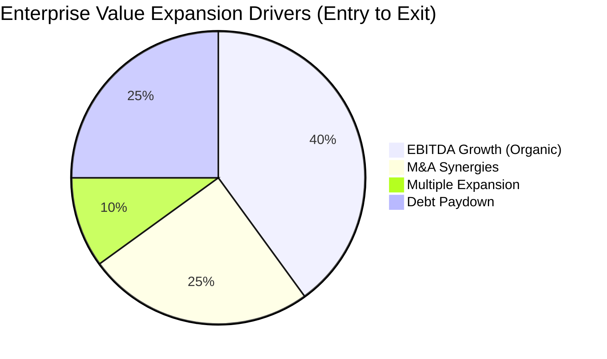

  
Investment Committee Memo

  
Project: [TARGET CODENAME / NAME] • Date: [Date]

  

    
Target Company

    
[Company Name] (HQ: [Location])

  

  

    
Transaction Overview

    
[100% LBO / Minority Growth Equity / Carve-out]

  

  

    
Enterprise Value (Entry)

    
**$[X]M** ([X.X]x LTM EBITDA)

  

  

    
Projected Returns (5-Year)

    
**Gross IRR: [XX]% | MOIC: [X.X]x**

  

  <h3 style="margin-top:0; color: #800000;">1. Investment Thesis</h3>
  
[A highly condensed, 4-sentence argument for why we are deploying capital. Focus on downside protection, intrinsic moat, and actionable value creation levers (e.g., pricing power, M&A rollout, margin expansion).]

<h2 class="h2-section">2. Business Quality & Market Position</h2>

[Detailed breakdown of the target's operating model, TAM/SAM, competitive landscape, and customer concentration. Highlight recurring revenue % and net revenue retention (NRR).]

<h2 class="h2-section">3. Financial Highlights & LBO Returns</h2>

### Historical & Projected Financials
<table class="fin-table">
  <tr>
    <th>($ in Millions)</th>
    <th>FY-2A</th>
    <th>FY-1A</th>
    <th>LTM</th>
    <th>FY+1E</th>
    <th>FY+3E</th>
  </tr>
  <tr>
    <td>Revenue</td>
    <td></td><td></td><td></td><td></td><td></td>
  </tr>
  <tr>
    <td>% Growth</td>
    <td></td><td></td><td></td><td></td><td></td>
  </tr>
  <tr>
    <td>Adjusted EBITDA</td>
    <td></td><td></td><td></td><td></td><td></td>
  </tr>
  <tr>
    <td>EBITDA Margin</td>
    <td></td><td></td><td></td><td></td><td></td>
  </tr>
  <tr>
    <td>Unlevered FCF</td>
    <td></td><td></td><td></td><td></td><td></td>
  </tr>
</table>

### Value Creation Bridge

<h2 class="h2-section">4. Key Due Diligence Findings (Red Flags & Mitigants)</h2>

1. **Quality of Earnings (QoE):** [Notes on working capital, one-off adjustments, capitalization of software.]
2. **Commercial DD:** [Customer calls synthesis. NPS scores. Churn analysis.]
3. **Legal/Tax/Tech:** [Cybersecurity risks, litigation, tax structure.]

<h2 class="h2-section">5. 100-Day Value Creation Plan</h2>

[Specific operational interventions planned immediately post-close: e.g., C-suite changes, ERP implementation, pricing strategy overhaul, accretive add-on acquisitions.]

<h2 class="h2-section">6. Recommendation</h2>

[Definitive recommendation to the Investment Committee with specific conditions precedent to close.]

